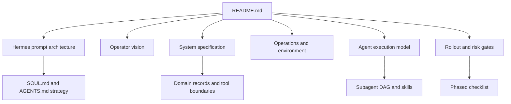

# New Showbiz Operator Specification Package

This repository is the build-ready documentation package for the New Showbiz marketing operator. It is not a runnable application. It specifies how to build a Hermes-backed, human-governed marketing system for `newshow.biz`, including prompt architecture, agent orchestration, channel tools, persistence contracts, risk controls, environment setup, rollout phases, and verification gates.

The central technical reference is [Hermes System Prompt Architecture](docs/10-hermes/HERMES_PROMPT_ARCHITECTURE.md). Every implementation decision in this package should respect that prompt model: stable identity in `SOUL.md`, project context in `AGENTS.md`, worker roles in `system_message`, dynamic task instructions in `ephemeral_system_prompt`, and durable business truth outside Hermes sessions.

## Package Map

| Area | Start here | Purpose |
|---|---|---|
| Vision | [Operator Overview](docs/00-vision/operator-overview.md) | Product thesis, runtime thesis, and strategic boundaries |
| Whitepaper | [Whitepaper](docs/00-vision/whitepaper.md) | Argument for a governed Hermes-backed operator |
| Hermes | [Prompt Architecture](docs/10-hermes/HERMES_PROMPT_ARCHITECTURE.md) | How Hermes assembles prompts and how workers should be spawned |
| Prompt profile | [Profile and Prompt Strategy](docs/10-hermes/profile-and-prompt-strategy.md) | How `SOUL.md`, `AGENTS.md`, skills, memory, and task prompts fit together |
| System spec | [Implementation Spec](docs/20-system-spec/implementation-spec.md) | Full build contract for records, tools, policies, and flows |
| Architecture | [Architecture](docs/20-system-spec/architecture.md) | Runtime, domain, channel, analytics, and oversight layers |
| Operations | [Tech Stack](docs/30-operations/tech-stack.md) | Recommended stack by phase |
| Environment | [Environment Setup](docs/30-operations/env-setup.md) | Required and optional environment variables without secret values |
| Documentation governance | [Documentation Governance](docs/30-operations/documentation-governance.md) | How this spec package is updated, verified, and kept coherent |
| Agents | [Subagent Execution Plan](docs/40-agents/subagent-execution-plan.md) | How subagents complete implementation and operations work |
| Source specs | [Agent Source Index](docs/40-agents/source/_index.md) | Preserved orchestrator, roster, skill, and queue specs |
| Rollout | [Phased Checklist](docs/50-rollout/phased-checklist.md) | Phase gates, dependencies, and exit criteria |
| Models | [Runtime Model Selection](docs/60-models/runtime-model-selection.md) | Model-card guidance and runtime migration notes |
| Diagrams | [Diagram Index](docs/diagrams/README.md) | Mermaid diagram catalog and authoring standard |

## Reading Path

1. Read [Hermes System Prompt Architecture](docs/10-hermes/HERMES_PROMPT_ARCHITECTURE.md) first. It defines the runtime facts that make the rest of the package implementable.
2. Read [Operator Overview](docs/00-vision/operator-overview.md) and [Product Spec](docs/20-system-spec/product-spec.md) to understand the product, channels, autonomy model, and domain records.
3. Read [Implementation Spec](docs/20-system-spec/implementation-spec.md) and [Domain Contracts](docs/20-system-spec/domain-contracts.md) before writing any code.
4. Read [Environment Setup](docs/30-operations/env-setup.md), [Secrets Policy](docs/30-operations/secrets-policy.md), and [Deployment Runbook](docs/30-operations/deployment-runbook.md) before configuring services.
5. Read [Documentation Governance](docs/30-operations/documentation-governance.md) before changing this package; it defines update loops for indexes, phase status, evidence checks, and safety scans.
6. Read [Subagent Execution Plan](docs/40-agents/subagent-execution-plan.md) before delegating work to agents or workers.
7. Use [Phased Checklist](docs/50-rollout/phased-checklist.md), [Acceptance Criteria](docs/50-rollout/acceptance-criteria.md), and [Risk Register](docs/50-rollout/risk-register.md) to decide whether a phase is ready.

## Build Status Map

| Surface | Status | Next build action |
|---|---|---|
| Documentation package | Active | Keep this repo as the canonical spec package |
| Documentation governance | Active | Use the scope, consistency, evidence, safety, and verification loops for every docs change |
| Hermes runtime | External dependency | Install and configure a dedicated `newshowbiz` profile |
| New Showbiz domain store | Specified, not implemented here | Build durable stores for jobs, receipts, metrics, incidents, and source evidence |
| X read integration | Phase 1 read-only | Use Scweet only with a throwaway read account and kill switch |
| X write integration | Phase 3+ | Wrap X MCP tools behind reviewed New Showbiz toolsets |
| Instagram integration | Deferred spec | Do not implement writes until channel contracts are written |
| Telegram oversight | Design spec | Use Hermes gateway or equivalent oversight path for approvals and reports |
| Metrics attribution | Specified | Implement UTM/site analytics/donation joins before optimization |
| Local `.env` | Private operator state | Keep local, never commit, never copy values into docs |

## Local Secret Policy

`.env` may exist in this workspace and may contain live credentials. It is local secret-bearing state, not documentation. Do not commit it, copy it into prompts, paste it into docs, or use it as a source of public values. Documentation must use [`.env.example`](docs/30-operations/.env.example) and the redacted variable catalog in [Environment Setup](docs/30-operations/env-setup.md).

Root `AGENTS.md` and root `MEMORY.md` are local workspace guidance/state and are ignored by git. Canonical profile context lives at [docs/10-hermes/AGENTS.md](docs/10-hermes/AGENTS.md); documentation-update process lives at [Documentation Governance](docs/30-operations/documentation-governance.md).

## Documentation Update Loops

Every docs change should run five loops:

1. **Scope loop:** identify affected doc families and downstream references.
2. **Consistency loop:** update indexes, package maps, reading paths, and phase status in the same pass.
3. **Evidence loop:** verify current tooling/platform/model/API claims against primary sources or mark them `needs_source_check`.
4. **Safety loop:** scan for secrets, credential-bearing URLs, local-only private values, and accidental `.env` leakage.
5. **Verification loop:** run `git diff --check`, inspect the changed files, and state any unverified surfaces.

## Diagram Index

The package standard is Mermaid inside Markdown. Key diagrams:

| Diagram | Location |
|---|---|
| Documentation package map | This README |
| Hermes prompt tiers | [Profile and Prompt Strategy](docs/10-hermes/profile-and-prompt-strategy.md) |
| Profile loading | [Hermes Profile Setup](docs/10-hermes/hermes-profile-setup.md) |
| Full operator architecture | [Implementation Spec](docs/20-system-spec/implementation-spec.md) |
| Outbound content flow | [Implementation Spec](docs/20-system-spec/implementation-spec.md) |
| Inbound engagement flow | [Implementation Spec](docs/20-system-spec/implementation-spec.md) |
| Escalation flow | [Risk Guardrails](docs/20-system-spec/risk-guardrails-and-escalation.md) and [Risk Register](docs/50-rollout/risk-register.md) |
| Metrics attribution | [Metrics and Reporting](docs/20-system-spec/metrics-and-reporting.md) |
| Subagent DAG | [Subagent Execution Plan](docs/40-agents/subagent-execution-plan.md) |
| Documentation update loop | [Subagent Execution Plan](docs/40-agents/subagent-execution-plan.md) |
| Rollout dependency graph | [Acceptance Criteria](docs/50-rollout/acceptance-criteria.md) |
| Secrets lifecycle | [Secrets Policy](docs/30-operations/secrets-policy.md) |
