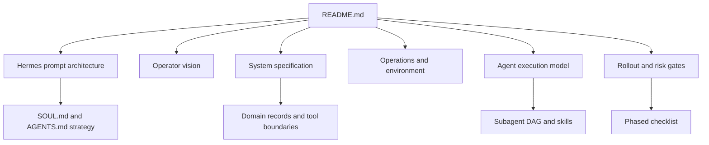

# New Showbiz Operator Specification Package

This repository is the build-ready documentation package for the New Showbiz marketing operator. It specifies how to build a Hermes-backed, human-governed marketing system for `newshow.biz`. The `newshowbiz` Hermes profile is now live on the operator's EC2 instance with X read integration active. Writing and content pipelines remain Phase 1 manual-review scope.

The central technical reference is [Hermes System Prompt Architecture](docs/10-hermes/HERMES_PROMPT_ARCHITECTURE.md). Every implementation decision in this package should respect that prompt model: stable identity in `SOUL.md`, project context in `AGENTS.md`, worker roles in `system_message`, dynamic task instructions in `ephemeral_system_prompt`, and durable business truth outside Hermes sessions.



## Package Map

| Area | Start here | Purpose |
|---|---|---|
| Vision | [Operator Overview](docs/00-vision/operator-overview.md) | Product thesis, runtime thesis, and strategic boundaries |
| Whitepaper | [Whitepaper](docs/00-vision/whitepaper.md) | Argument for a governed Hermes-backed operator |
| Hermes | [Prompt Architecture](docs/10-hermes/HERMES_PROMPT_ARCHITECTURE.md) | How Hermes assembles prompts and how workers should be spawned |
| Prompt profile | [Profile and Prompt Strategy](docs/10-hermes/profile-and-prompt-strategy.md) | How `SOUL.md`, `AGENTS.md`, skills, memory, and task prompts fit together |
| System spec | [Implementation Spec](docs/20-system-spec/implementation-spec.md) | Full build contract for records, tools, policies, and flows |
| Architecture | [Architecture](docs/20-system-spec/architecture.md) | Runtime, domain, channel, analytics, and oversight layers |
| Operations | [Tech Stack](docs/30-operations/tech-stack.md) | Recommended stack by phase |
| Environment | [Environment Setup](docs/30-operations/env-setup.md) | Required and optional environment variables without secret values |
| X MCP test log | [X MCP Test Log](docs/30-operations/x-mcp-test-log.md) | Per-tool test results, login.js patches, rate limit incident, recovery steps |
| Documentation governance | [Documentation Governance](docs/30-operations/documentation-governance.md) | How this spec package is updated, verified, and kept coherent |
| Agents | [Subagent Execution Plan](docs/40-agents/subagent-execution-plan.md) | How subagents complete implementation and operations work |
| Source specs | [Agent Source Index](docs/40-agents/source/_index.md) | Orchestrator, roster, skill, and queue specs |
| Rollout | [Phased Checklist](docs/50-rollout/phased-checklist.md) | Phase gates, dependencies, and exit criteria |
| Models | [Runtime Model Selection](docs/60-models/runtime-model-selection.md) | Model-card guidance and runtime migration notes |
| Diagrams | [Diagram Index](docs/diagrams/README.md) | Mermaid diagram catalog and authoring standard |

## Live Implementation State

**Instance:** EC2 (i-05451add3165b57ff) · Hermes v0.14.0 · Node.js v22 · Python 3.11

**Profile:** `hermes -p newshowbiz`

The `newshowbiz` Hermes profile is deployed and operational. SOUL.md, AGENTS.md, all 7 personality overlays, and the full X MCP stack are live.

### What works now

```
hermes -p newshowbiz
/personality x-editor          → draft X posts from source material
/personality audience-researcher → search X for film discourse, trends, source candidates
/personality brand-director    → review and approve or reject draft copy
/personality growth-analyst    → pull X profile/timeline data, structure performance notes
```

**`x-mcp-read` (Barresider) — authenticated reads, session pending.** The server connects and all 8 tools are registered with engagement tools excluded. Authentication was blocked by a temporary X rate limit from rapid login attempts during canary testing. Once the rate limit clears, call `login` once to save the session to `x-auth/`; all read tools (`search_twitter`, `search_viral`, `scrape_trending`, `scrape_timeline`, `scrape_posts`, `scrape_profile`, `scrape_comments`) will be operational. Four bugs in Barresider's `login.js` were found and patched (stale URL, selector drift, headless mode, auth path).

**`twitter-mcp` (miles0sage) — `twitter_user` only without auth.** Tested live: profile lookup for `@new_show_biz` returned correct name, bio, and follower counts. All other tools (`twitter_search`, `twitter_user_tweets`, `twitter_trending`, `twitter_feed`) hit X login walls and return timeouts. This server has no authentication support; its practical scope is public profile lookups only.

The Playwright MCP (global) is available for browser QA, page-state inspection, and New Showbiz site verification.

### What is not yet operational

| Capability | Blocked by |
|---|---|
| Autonomous X posts | `x-mcp-write` is disabled — enable only after ContentJob store, policy engine, human approval path, and receipt store exist |
| Content creation pipeline | ContentJob schema and domain store not yet built |
| Policy engine | Not built — required before any write path |
| Telegram oversight | Gateway not configured — required before Phase 4 autonomy |
| Engagement automation | Permanently excluded from all MCP configs (`like`, `retweet`, `bookmark`) |
| Instagram | Deferred — no channel spec written yet |

### X MCP configuration decisions

Four servers are configured in `~/.hermes/profiles/newshowbiz/config.yaml` and documented in [hermes-config.example.yaml](docs/10-hermes/hermes-config.example.yaml):

| Server | Source | Status | Tested result |
|---|---|---|---|
| `x-mcp-read` | `@barresider/x-mcp` | **enabled** | Connects, 8 tools registered, login.js patched — auth pending (rate limit) |
| `x-mcp-write` | `@barresider/x-mcp` | **disabled** | Not tested — disabled until Phase 3 content pipeline exists |
| `twitter-mcp` | `miles0sage/twitter-mcp` (git) | **enabled** | `twitter_user` confirmed working; all other tools hit X login walls |
| `social-mcp` | `kitadmin01/social_mcp` (git) | **disabled** | Source inspected — `engage_twitter` mass-liking tool confirmed present; keep disabled |

Barresider was chosen as the primary adapter over alternatives because it has explicit tool boundaries, persistent session support, proxy configuration, and a clear MCP interface. The spec discussion is in [X MCP Options](docs/20-system-spec/x-mcp-options-and-discussions.md).

Engagement tools (`like_post`, `retweet_post`, `bookmark_post`, and equivalents) are excluded from all server configs at the Hermes MCP filter level — they do not appear in any agent's toolset regardless of what task is requested.

Write tools (`tweet`, `thread`, `reply_to_post`, `quote_tweet`) exist in `x-mcp-write` but that server is `enabled: false`. Flipping it requires all Phase 3 acceptance criteria to pass first — see [Acceptance Criteria](docs/50-rollout/acceptance-criteria.md).

### Phase 1 workflow

Until authentication is complete and the content pipeline is built, the operator runs in assisted-draft mode:

**Step 0 (one-time): Complete x-mcp-read authentication**
1. Wait for X rate limit to clear (a few hours after 2026-06-01 testing)
2. `hermes -p newshowbiz`
3. Call the `login` tool — authenticates and saves session to `~/.hermes/profiles/newshowbiz/x-auth/twitter.json`
4. Verify: the tool should return success and the session file should exist

**Ongoing assisted-draft loop**
1. Open `hermes -p newshowbiz`
2. Use `audience-researcher` + `search_twitter`/`scrape_trending` to surface film discourse and trend signals
3. Use `twitter_user` to pull competitor or reference account profiles (no auth needed)
4. Use `x-editor` or `product-explainer` to draft posts from source material
5. Use `brand-director` to review drafts against Kakusu Protocol and brand rules
6. Copy approved text and post manually from the X account
7. No autonomous publishing, no scheduled posts, no replies without human review

Until the session is saved, `audience-researcher` can only use `twitter_user` for public profile lookups. All search and trending tools require the authenticated session from Step 0.

This is the correct Phase 1 posture. The content pipeline (ContentJob → ValidateAgent → PublishAgent → receipt) is what makes Phase 3 writes safe. Do not shortcut by enabling `x-mcp-write` before that pipeline exists. Full test findings: [X MCP Test Log](docs/30-operations/x-mcp-test-log.md).

## Reading Path

1. Read [Hermes System Prompt Architecture](docs/10-hermes/HERMES_PROMPT_ARCHITECTURE.md) first. It defines the runtime facts that make the rest of the package implementable.
2. Read [Operator Overview](docs/00-vision/operator-overview.md) and [Product Spec](docs/20-system-spec/product-spec.md) to understand the product, channels, autonomy model, and domain records.
3. Read [Implementation Spec](docs/20-system-spec/implementation-spec.md) and [Domain Contracts](docs/20-system-spec/domain-contracts.md) before writing any code.
4. Read [Environment Setup](docs/30-operations/env-setup.md), [Secrets Policy](docs/30-operations/secrets-policy.md), and [Deployment Runbook](docs/30-operations/deployment-runbook.md) before configuring services.
5. Read [Documentation Governance](docs/30-operations/documentation-governance.md) before changing this package; it defines update loops for indexes, phase status, evidence checks, and safety scans.
6. Read [Subagent Execution Plan](docs/40-agents/subagent-execution-plan.md) before delegating work to agents or workers.
7. Use [Phased Checklist](docs/50-rollout/phased-checklist.md), [Acceptance Criteria](docs/50-rollout/acceptance-criteria.md), and [Risk Register](docs/50-rollout/risk-register.md) to decide whether a phase is ready.

## Build Status Map

| Surface | Status | Next build action |
|---|---|---|
| Documentation package | Active | Keep this repo as the canonical spec package |
| Documentation governance | Active | Use the scope, consistency, evidence, safety, and verification loops for every docs change |
| Hermes runtime | **Live** — `newshowbiz` profile deployed | Profile operational; update when Hermes upgrades past v0.14.0 |
| X read integration | **Partial** — `twitter_user` live; Barresider auth pending | `twitter_user` confirmed; x-mcp-read session blocked by rate limit from 2026-06-01 testing — retry login after rate limit clears |
| X write integration | Configured, disabled | Build ContentJob store, policy engine, approval path, and receipt store; then enable `x-mcp-write` |
| New Showbiz domain store | Specified, not implemented | Build durable stores for ContentJob, EngagementJob, EscalationRecord, PerformanceSnapshot |
| Content creation pipeline | Specified, not implemented | PersonaRegistry, TaskRouter, ContentJob schema, template libraries, manual-review workflow |
| Instagram integration | Deferred spec | Do not implement writes until channel contracts are written |
| Telegram oversight | Design spec | Configure Hermes gateway with bot token and allowlisted chat IDs |
| Metrics attribution | Specified | Implement UTM/site analytics/donation joins before optimization |
| Local `.env` | Private operator state | Keep local, never commit, never copy values into docs |

## Local Secret Policy

`.env` may exist in this workspace and may contain live credentials. It is local secret-bearing state, not documentation. Do not commit it, copy it into prompts, paste it into docs, or use it as a source of public values. Documentation must use [`.env.example`](docs/30-operations/.env.example) and the redacted variable catalog in [Environment Setup](docs/30-operations/env-setup.md).

Root `AGENTS.md` and root `MEMORY.md` are local workspace guidance/state and are ignored by git. Canonical profile context lives at [docs/10-hermes/AGENTS.md](docs/10-hermes/AGENTS.md); documentation-update process lives at [Documentation Governance](docs/30-operations/documentation-governance.md).

## Documentation Update Loops

Every docs change should run five loops:

1. **Scope loop:** identify affected doc families and downstream references.
2. **Consistency loop:** update indexes, package maps, reading paths, and phase status in the same pass.
3. **Evidence loop:** verify current tooling/platform/model/API claims against primary sources or mark them `needs_source_check`.
4. **Safety loop:** scan for secrets, credential-bearing URLs, local-only private values, and accidental `.env` leakage.
5. **Verification loop:** run `git diff --check`, inspect the changed files, and state any unverified surfaces.

## Diagram Index

The package standard is Mermaid inside Markdown. Key diagrams:

| Diagram | Location |
|---|---|
| Documentation package map | This README |
| Hermes prompt tiers | [Profile and Prompt Strategy](docs/10-hermes/profile-and-prompt-strategy.md) |
| Profile loading | [Hermes Profile Setup](docs/10-hermes/hermes-profile-setup.md) |
| Full operator architecture | [Implementation Spec](docs/20-system-spec/implementation-spec.md) |
| Outbound content flow | [Implementation Spec](docs/20-system-spec/implementation-spec.md) |
| Inbound engagement flow | [Implementation Spec](docs/20-system-spec/implementation-spec.md) |
| Escalation flow | [Risk Guardrails](docs/20-system-spec/risk-guardrails-and-escalation.md) and [Risk Register](docs/50-rollout/risk-register.md) |
| Metrics attribution | [Metrics and Reporting](docs/20-system-spec/metrics-and-reporting.md) |
| Subagent DAG | [Subagent Execution Plan](docs/40-agents/subagent-execution-plan.md) |
| Documentation update loop | [Subagent Execution Plan](docs/40-agents/subagent-execution-plan.md) |
| Rollout dependency graph | [Acceptance Criteria](docs/50-rollout/acceptance-criteria.md) |
| Secrets lifecycle | [Secrets Policy](docs/30-operations/secrets-policy.md) |
