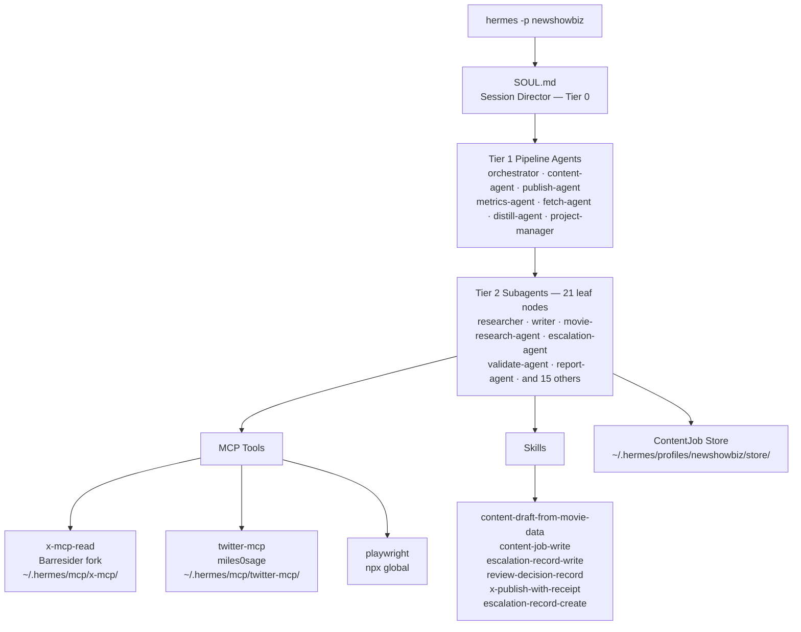

# New Showbiz Marketing Operator

**What this is:** A deployed autonomous marketing operator for [newshow.biz](https://newshow.biz) built on a heavily customized ("hacked") instance of Hermes Agent v0.15.1. The system uses a 29-agent, three-tier architecture to research films from the New Showbiz catalog, generate governed social content, route it through human review, and (in Phase 3) publish to X and Instagram. It is live on EC2. This repository is the documentation package, canonical spec, and operational reference for that system.

**This is not a spec-for-something-to-build.** The agent system is deployed. The Hermes instance is running. The newshowbiz profile, all 29 agents, the template library, the ContentJob store, and the MCP stack are live. This repo documents what exists and what's next.

---

## Live System at a Glance

| Property | Value |
|---|---|
| **Instance** | EC2 i-05451add3165b57ff (Amazon Linux 2023) |
| **Hermes version** | v0.15.1 (2026-05-29) |
| **Hermes root** | `~/.hermes/` (684 MB total) |
| **Profile** | `newshowbiz` — `hermes -p newshowbiz` |
| **Orchestrator model** | `deepseek/deepseek-v4-pro` via OpenRouter |
| **Subagent model** | `deepseek/deepseek-v4-flash` via OpenRouter |
| **Fallback model** | `anthropic/claude-sonnet-4` via OpenRouter |
| **Agent tiers** | Tier 0 (1) · Tier 1 (7) · Tier 2 (21) = 29 agents total |
| **Active MCP servers** | x-mcp-read (Barresider fork), twitter-mcp, playwright, github |
| **Custom skills** | 6 New Showbiz domain skills + 8-template library |
| **Content pipeline** | Flat-file ContentJob store (Phase 1) |
| **Phase** | Phase 1 (~80% complete) |
| **Current phase gate** | X auth retry → first content run → 7-day approved queue |

---

## Architecture Overview



---

## The Hacked Hermes Instance

This is not a standard Hermes deployment. The following customizations have been made to a stock Hermes v0.15.1 installation. Together they constitute the "hacked instance" that powers this operator.

### 1. Three-Tier Agent Architecture

Stock Hermes has a flat persona system — one SOUL.md, one session, worker agents as needed. This deployment imposes a strict three-tier execution authority model enforced at both the prompt level (each agent file declares its tier) and the runtime level (`max_spawn_depth: 2` in global config):

| Tier | Role | Spawn Authority | Count |
|---|---|---|---|
| **0** | Session Director (SOUL.md) | Routes to Tier 1 and Tier 2 | 1 |
| **1** | Pipeline Agents | Can spawn Tier 2; cannot spawn other Tier 1 | 7 |
| **2** | Leaf Subagents | Cannot delegate further | 21 |

The 30 persona files in `~/.hermes/personas/` map out this hierarchy. Each agent file opens with a tier declaration so the agent understands its authority limits before receiving any task.

### 2. Anti-Fabrication Enforcement

DeepSeek V4 Flash (the subagent model) has a documented failure mode: it may substitute plausible-sounding fabricated output when a tool call fails, rather than reporting the failure. This is addressed at every layer of the system:

- `~/.hermes/SOUL.md` — operational rule: "Anti-fabrication (critical): You are running on DeepSeek..."
- `~/.hermes/personas/_shared-contract.md` — Section 4: named DeepSeek failure mode, explicit BLOCKED reporting rules
- All 28 agent persona files — "If a tool call, file read, or API call fails, report the blocker as BLOCKED..."
- `~/.hermes/prefill_messages.json` — few-shot priming demonstrating a correct BLOCKED response in a Tier 0 → Tier 1 → Tier 2 delegation cycle

### 3. DeepSeek Model Split

Stock Hermes uses one model for all turns. This deployment routes:
- Orchestrator/session turns → `deepseek/deepseek-v4-pro` (higher reasoning, higher cost)
- Delegated subagent calls → `deepseek/deepseek-v4-flash` (fast, cheap, acceptable quality for leaf tasks)
- Any failure → `anthropic/claude-sonnet-4` via OpenRouter fallback

### 4. Barresider Local Fork

The upstream `@barresider/x-mcp` package has bugs that prevent login from EC2 IP ranges. The npx cache is ephemeral — patches applied once will be lost on cache clear. Resolution: a permanent git clone at `~/.hermes/mcp/x-mcp/` with patches applied to the TypeScript source and rebuilt.

Five patches applied to `src/behaviors/login.ts`:

| Bug | Fix |
|---|---|
| Stale login URL | `twitter.com` → `x.com/i/flow/login` with `domcontentloaded` + 4s hydration wait |
| Username selector drift | XPath `autocomplete="username"` → `input[name="username_or_email"]` |
| Next/Continue button | XPath exact text → `span:text("Next"), span:text("Continue")` first match |
| Auth dir not created | Added `fs.mkdirSync(authDir, { recursive: true })` before first write |
| stdio pollution | All `console.log` → `console.error` (stdout is the MCP JSON-RPC channel) |

Profile config uses `node /home/ec2-user/.hermes/mcp/x-mcp/dist/mcp.js` — npx never re-downloads the upstream package.

### 5. ContentJob Flat-File Store

Stock Hermes has no content persistence. This deployment adds a domain-specific store at `~/.hermes/profiles/newshowbiz/store/` with a human-readable file layout, three write skills, and an append-only audit trail.

### 6. Content Template Library

8 platform-specific templates at `~/.hermes/profiles/newshowbiz/skills/templates/` (5 X, 3 Instagram). Each template encodes objective, character limits, hashtag ceilings, structural skeleton, Kakusu Protocol enforcement, and a prohibition list. The `content-draft-from-movie-data` skill selects a template before drafting.

### 7. Kakusu Protocol (Brand Rule)

All content agents operate under a brand constraint: frame representation analysis as cinematic analysis, not advocacy. Loaded vocabulary is prohibited across all templates and agent files: "woke," "DEI," "subversive," "progressive," "political activism." Analysis is presented as film criticism.

---

## Agent System

### Tier 0 — Session Director

**`~/.hermes/SOUL.md`** is loaded as the first stable prompt block in every session. It contains: the three-tier architecture table, quick routing reference by task type, 7-step workflow, authorized pipeline list, and anti-fabrication rules.

### Tier 1 — Pipeline Agents (7)

| Agent | Purpose | Authorized Subagents |
|---|---|---|
| `orchestrator` | Classifies ambiguous tasks; routes across domains | All Tier 2 |
| `content-agent` | Film research → draft → publish pipeline | validate, writer, compose, movie-research-agent, report, escalation |
| `publish-agent` | Validated publish with receipts | validate, report, escalation |
| `metrics-agent` | Data collection → analysis → report | analysis, report, query |
| `fetch-agent` | Source fetch → transform → report | validate, transform, report |
| `distill-agent` | Skill extraction and improvement loop | skill-builder, report |
| `project-manager` | Multi-domain project decomposition | All Tier 2 |

### Tier 2 — Leaf Subagents (21)

analysis-agent · compose · composer-translator · diff-agent · engagement-agent · escalation-agent · execute-agent · interrogator · librarian · lint-agent · movie-research-agent · python-standards-agent · query-agent · report-agent · researcher · skill-builder · transform-agent · validate-agent · writer · designer · editor

### Routing Registry

`~/.hermes/personas/_routing.md` — 27 canonical task types mapped to agents with tier, pipeline pattern, and authorized spawn paths. It is read by SOUL.md and the orchestrator. Callable spec: [docs/20-system-spec/task-router.md](docs/20-system-spec/task-router.md).

---

## MCP Stack

All X interaction uses Playwright browser automation. EC2 IP ranges receive 403s from Cloudflare on direct HTTP to x.com — raw API/HTTP calls to X will fail.

| Server | Location | Status | Auth | Tools |
|---|---|---|---|---|
| `x-mcp-read` | `~/.hermes/mcp/x-mcp/` (Barresider fork) | **Enabled** | X credentials | login, search_twitter, scrape_trending, scrape_timeline, scrape_posts, scrape_profile, scrape_comments (7 read tools) |
| `x-mcp-write` | `~/.hermes/mcp/x-mcp/` (Barresider fork) | **Disabled** (Phase 3 gate) | X credentials | tweet, thread, reply_to_post, quote_tweet |
| `twitter-mcp` | `~/.hermes/mcp/twitter-mcp/` (miles0sage) | **Enabled** | None | twitter_user (public profile only; other tools hit X login walls) |
| `social-mcp` | `~/.hermes/mcp/social_mcp/` (kitadmin01) | **Disabled** (reference) | Google Sheets | Contains engage_twitter mass-like tool — keep disabled |
| `playwright` | npx (global) | **Enabled** | None | Full browser automation fallback |
| `github` | npx (global) | **Enabled** | GitHub PAT | Repo operations |

Engagement tools (`like_post`, `retweet_post`, `bookmark_post`, and equivalents) are excluded from all server configs at the Hermes MCP filter level.

---

## Content Pipeline

```
newshow.biz movie page
        │
        ▼
movie-research-agent
(film data, scores, watch links, source refs)
        │
        ▼
content-draft-from-movie-data skill
  → select template (_index.md)
  → draft in film-critic register
  → enforce Kakusu Protocol
  → platform constraint check
  → risk classification
        │
        ▼
content-job-write skill
  → writes ContentJob JSON to store/jobs/{id}.json
  → copies to store/review-queue/{id}.json
  → agent outputs plain-text review summary
        │
        ▼
Human review (manual-review-procedure.md)
  approve / reject / revise {id}
        │
        ▼
review-decision-record skill
  → records decision
  → moves file (approved/ or rejected/)
  → appends store/review-log.jsonl
        │
        ▼ (Phase 3, x-mcp-write enabled)
x-publish-with-receipt skill
  → validates approved ContentJob
  → calls tweet/thread via x-mcp-write
  → writes durable receipt
```

**ContentJob ID format:** `{ISO-date}T{HHmmss}-{4-char-hex}` (e.g., `2026-06-05T143022-a3f1`)

**Risk classification:** low / medium / high / blocked — all drafts must carry one. Medium and above triggers escalation-agent review before moving to review-queue.

---

## Directory Structure

### Documentation repo (`no-hay-banda/`)

```
docs/
  00-vision/
    operator-overview.md              ← Product thesis and system assessment
    whitepaper.md                     ← Strategic argument for a governed operator
  10-hermes/
    hermes-instance.md                ← Full technical reference for the hacked instance ★
    hermes-profile-setup.md           ← Setup and replication guide (Barresider fork)
    hermes-config.example.yaml        ← Redacted config template
    HERMES_PROMPT_ARCHITECTURE.md     ← How Hermes assembles prompts
    SOUL.md                           ← Profile-scoped SOUL.md source
    AGENTS.md                         ← Profile-scoped AGENTS.md source
    tier-architecture.md              ← Three-tier model documentation
  20-system-spec/
    domain-contracts.md               ← ContentJob, EscalationRecord, PerformanceSnapshot schemas
    persona-registry.md               ← 7 personalities → agents/toolsets/phase gates
    task-router.md                    ← Callable routing spec (wraps _routing.md)
    implementation-spec.md            ← Full build contract
    architecture.md                   ← Runtime and domain architecture
  30-operations/
    env-setup.md                      ← Environment variables (no values)
    manual-review-procedure.md        ← Human review SOP ★
    x-mcp-test-log.md                 ← Per-tool results, patches, incidents
    secrets-policy.md                 ← What never gets committed
  40-agents/source/
    _index.md                         ← Agent source index
    _routing.md                       ← Task-to-agent routing registry
    _shared-contract.md               ← Governing contract for all agents
    roster/                           ← 28 agent spec files
    skills/
      _index.md                       ← Skill registry (6 New Showbiz + vault skills)
      content-draft-from-movie-data.md
      content-job-write.md
      escalation-record-write.md
      review-decision-record.md
      x-publish-with-receipt.md
      escalation-record-create.md
    templates/                        ← Mirror of live template library
      _index.md                       ← Template selection logic
      x/                              ← 5 X templates
      instagram/                      ← 3 Instagram templates
  50-rollout/
    phased-checklist.md               ← Phase gates and exit criteria
    acceptance-criteria.md            ← Phase-specific pass/fail criteria
    risk-register.md                  ← Known risks and mitigations
```

### Live Hermes system (`~/.hermes/`)

```
~/.hermes/
  config.yaml                         ← Global Hermes config (v25 format)
  SOUL.md                             ← Session Director — loaded every session
  prefill_messages.json               ← Delegation cycle priming (4 messages)
  state.db                            ← 15 MB SQLite (Hermes internal state)
  personas/                           ← 30 files (28 agents + 2 contracts)
    SOUL.md                           ← Session Director persona (symlink or copy)
    _shared-contract.md               ← Governing contract for all agents
    _routing.md                       ← Task-to-agent routing registry
    orchestrator.md                   ← Tier 1
    content-agent.md                  ← Tier 1
    publish-agent.md                  ← Tier 1
    metrics-agent.md                  ← Tier 1
    fetch-agent.md                    ← Tier 1
    distill-agent.md                  ← Tier 1
    project-manager.md                ← Tier 1
    [21 Tier 2 agent files]
  mcp/
    x-mcp/                            ← Barresider local fork (121 MB, patched)
      src/behaviors/login.ts          ← Patched source (5 fixes)
      dist/behaviors/login.js         ← Compiled output
      PATCHES.md                      ← Patch documentation
    twitter-mcp/                      ← miles0sage fork (207 MB)
      venv/                           ← Python 3.11 virtualenv
      server.py
    social_mcp/                       ← kitadmin01 fork (293 MB, disabled)
  profiles/newshowbiz/
    config.yaml                       ← Profile MCP, toolsets, personalities
    SOUL.md                           ← Marketing operator identity
    .env                              ← TWITTER_USERNAME, TWITTER_PASSWORD, OPENROUTER_API_KEY
    x-auth/                           ← Barresider session (twitter.json after login)
    store/
      jobs/                           ← ContentJob JSON files (canonical)
      escalations/                    ← EscalationRecord JSON files
      review-queue/                   ← Drafts pending human review
      approved/                       ← Approved ContentJobs
      rejected/                       ← Rejected ContentJobs
      review-log.jsonl                ← Append-only decision audit trail
    skills/
      content-draft-from-movie-data/SKILL.md
      content-job-write/SKILL.md
      escalation-record-write/SKILL.md
      review-decision-record/SKILL.md
      x-publish-with-receipt/SKILL.md
      escalation-record-create/SKILL.md
      templates/
        _index.md                     ← Template selection logic
        x/original-discovery.md
        x/thread-breakdown.md
        x/comparison-post.md
        x/reactive-hook.md
        x/utility-post.md
        instagram/caption-standard.md
        instagram/carousel-intro.md
        instagram/caption-utility.md
    sessions/                         ← 3 recorded sessions
    memories/                         ← Agent memory store (empty — not yet used)
    logs/                             ← Session and MCP logs
```

---

## Running It

```bash
# Start a newshowbiz session (all 29 agents available, all MCP servers connected)
hermes -p newshowbiz

# Activate a personality overlay within the session
/personality x-editor
/personality audience-researcher
/personality brand-director
/personality product-explainer
/personality growth-analyst

# Check what's in the review queue
ls ~/.hermes/profiles/newshowbiz/store/review-queue/

# Read the audit log
cat ~/.hermes/profiles/newshowbiz/store/review-log.jsonl

# List skills
hermes -p newshowbiz skills list

# Check Hermes version
hermes --version
```

**Authenticate x-mcp-read (pending — one-time step):**
```bash
hermes -p newshowbiz
# In session: invoke the login tool
# Verify: ls ~/.hermes/profiles/newshowbiz/x-auth/
```

Note: call login once. If X returns a rate limit or challenge, wait several hours and retry once. Do not loop. See [X MCP Test Log](docs/30-operations/x-mcp-test-log.md) for the 2026-06-01 rate-limit incident.

**Rebuild Barresider after source edits:**
```bash
cd ~/.hermes/mcp/x-mcp
# edit src/behaviors/login.ts
npm run build
hermes gateway restart   # if gateway is running
```

---

## Current Status — Phase 1

### What is fully operational

| Capability | State |
|---|---|
| Hermes runtime | Live — v0.15.1, DeepSeek V4 Pro/Flash |
| Three-tier agent system | Live — 29 agents, all tier declarations and contracts in place |
| Anti-fabrication enforcement | Live — present at every layer |
| `twitter-mcp` public lookups | Live — `twitter_user` confirmed working |
| Barresider local fork | Built — 5 patches applied, compiled, profile wired |
| 7 personality overlays | Live — brand-director, audience-researcher, product-explainer, x-editor, instagram-editor, provocateur, growth-analyst |
| Template library | Live — 5 X templates + 3 Instagram templates |
| ContentJob flat-file store | Live — directory structure + 3 write skills |
| Manual review workflow | Live — procedure doc + review-decision-record skill |
| Persona registry | Live — 7 personalities mapped to agents/toolsets/phase gates |
| Task router | Live — callable spec wrapping the routing registry |
| VS Code server cleanup | Live — systemd timer, weekly Sunday midnight |

### What is pending

| Capability | Blocker |
|---|---|
| `x-mcp-read` authenticated search | X auth retry not yet run (rate limit has cleared — needs one login call) |
| First content run | Requires human decisions: campaign priorities, cadence, CTA preference, review SLA |
| 7-day approved draft queue | Depends on first content run |
| Phase 1 exit report | Follows first content run |

### What is intentionally disabled

| Capability | Reason |
|---|---|
| `x-mcp-write` (tweet/thread) | Phase 3 gate — requires ContentJob store, policy engine, human approval path, and receipt store (all Phase 3) |
| `social-mcp` | Contains mass-engagement tools (`engage_twitter`) — permanently excluded |
| Engagement tools (like/retweet/bookmark) | Filtered at Hermes MCP level across all servers |
| Autonomous publishing | Phase 3 — not before full policy engine and Telegram oversight |
| Instagram writes | Phase 4 — channel contract not yet written |

### Phase map

| Phase | Status | Exit Criteria |
|---|---|---|
| **Phase 0** — Documentation | Complete | Spec package published to GitHub |
| **Phase 1** — Governed draft production | ~80% complete | 7-day approved draft queue, X auth live, review workflow exercised |
| **Phase 2** — Scheduled content | Not started | Cron pipeline, ContentJob → EngagementJob flow |
| **Phase 3** — Supervised publish | Not started | `x-mcp-write` enabled, policy engine, receipt store, Telegram oversight |
| **Phase 4** — Analytics loop | Not started | UTM attribution, PerformanceSnapshot, campaign optimization |
| **Phase 5** — Instagram | Not started | Channel contract, caption pipeline, approval flow |
| **Phase 6** — Full autonomy | Not started | All prior phases stable; Telegram oversight required before any unattended operation |

---

## Document Map

| Need | Document |
|---|---|
| Full hacked instance reference | [docs/10-hermes/hermes-instance.md](docs/10-hermes/hermes-instance.md) ★ |
| Setup on a new machine | [docs/10-hermes/hermes-profile-setup.md](docs/10-hermes/hermes-profile-setup.md) |
| How Hermes assembles prompts | [docs/10-hermes/HERMES_PROMPT_ARCHITECTURE.md](docs/10-hermes/HERMES_PROMPT_ARCHITECTURE.md) |
| Product vision and assessment | [docs/00-vision/operator-overview.md](docs/00-vision/operator-overview.md) |
| Domain record schemas | [docs/20-system-spec/domain-contracts.md](docs/20-system-spec/domain-contracts.md) |
| Persona → agent → toolset mapping | [docs/20-system-spec/persona-registry.md](docs/20-system-spec/persona-registry.md) |
| Task routing spec | [docs/20-system-spec/task-router.md](docs/20-system-spec/task-router.md) |
| Human review procedure | [docs/30-operations/manual-review-procedure.md](docs/30-operations/manual-review-procedure.md) |
| X MCP test results and patches | [docs/30-operations/x-mcp-test-log.md](docs/30-operations/x-mcp-test-log.md) |
| Environment variables | [docs/30-operations/env-setup.md](docs/30-operations/env-setup.md) |
| Agent source specs | [docs/40-agents/source/_index.md](docs/40-agents/source/_index.md) |
| Skill registry | [docs/40-agents/source/skills/_index.md](docs/40-agents/source/skills/_index.md) |
| Template library | [docs/40-agents/source/templates/_index.md](docs/40-agents/source/templates/_index.md) |
| Phase gates and exit criteria | [docs/50-rollout/phased-checklist.md](docs/50-rollout/phased-checklist.md) |
| Risk register | [docs/50-rollout/risk-register.md](docs/50-rollout/risk-register.md) |

---

## Security Posture

| Rule | Detail |
|---|---|
| Never commit `.env` | Profile `.env` has X credentials and OPENROUTER_API_KEY |
| Never commit `config.yaml` | Global config has GitHub PAT in plaintext (github MCP entry) |
| Never commit `x-auth/` | Contains live X session cookies |
| x-mcp-write disabled | Will not be enabled before Phase 3 acceptance criteria pass |
| Engagement tools excluded | Filtered at MCP config level — not accessible to any agent |
| GitHub PAT | Stored as `GITHUB_PAT_WRITE` in `~/.hermes/.env`; owned by `CSandbatch` (St-Expedite-Press org) |
| Secrets policy | Full policy: [docs/30-operations/secrets-policy.md](docs/30-operations/secrets-policy.md) |

---

*Hermes v0.15.1 · DeepSeek V4 Pro/Flash via OpenRouter · EC2 i-05451add3165b57ff · Phase 1 active · 2026-06-05*
