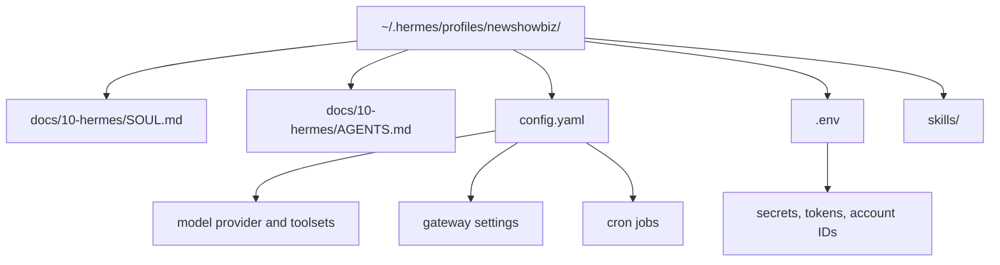

# Hermes Profile Setup

This is the target profile shape for the future runnable implementation. This documentation package does not install Hermes or run the operator.

## Profile Files

## Installation Shape

1. Create `~/.hermes/profiles/newshowbiz/docs/10-hermes/`.
2. Copy `docs/10-hermes/SOUL.md` to `~/.hermes/profiles/newshowbiz/docs/10-hermes/SOUL.md`.
3. Copy `docs/10-hermes/AGENTS.md` to `~/.hermes/profiles/newshowbiz/docs/10-hermes/AGENTS.md`.
4. Copy `docs/10-hermes/hermes-config.example.yaml` to `~/.hermes/profiles/newshowbiz/config.yaml`.
5. Copy `docs/30-operations/.env.example` to `~/.hermes/profiles/newshowbiz/.env` and populate with real credentials.
6. Create `~/.hermes/profiles/newshowbiz/x-auth/` for Barresider session persistence.
7. For the git-cloned MCP servers (twitter-mcp, social-mcp), update the absolute paths in config.yaml to match your machine.
8. Install skills from `docs/40-agents/source/skills/` only after reviewing them against the current implementation.

## Profile Boundaries

| Surface | Rule |
|---|---|
| Secrets | Profile-local only; never committed |
| Gateway | Internal oversight only |
| X writes | Disabled until Phase 3+ reviewed wrappers exist |
| Instagram writes | Disabled until channel spec is complete |
| Memory | Trace material, not business truth |
| Cron | Must fetch durable state before acting |
| Toolsets | Least privilege per workflow |

## Personality Overlays

The retained `hermes-config.example.yaml` documents intended overlays such as `x-editor`, `instagram-editor`, `brand-director`, and `growth-analyst`. They are prompt conveniences, not public personas. All public output remains the single New Showbiz brand voice.

