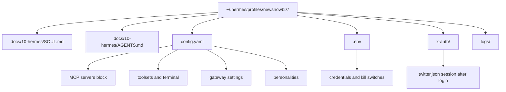

# Hermes Profile Setup

The `newshowbiz` profile is deployed on EC2 (i-05451add3165b57ff) at `~/.hermes/profiles/newshowbiz/`. This doc describes the profile structure and the steps to replicate it elsewhere.

## Profile Files



## System Prerequisites (Amazon Linux 2023)

Before the Playwright-based MCP servers will launch, install these packages:

```bash
sudo dnf install -y \
  atk at-spi2-atk cups-libs libdrm libxkbcommon \
  libXcomposite libXdamage libXfixes libXrandr \
  libgbm mesa-libgbm pango alsa-lib nss \
  xorg-x11-server-Xvfb
```

Verify Chromium headless shell works:
```bash
~/.cache/ms-playwright/chromium_headless_shell-1223/chrome-headless-shell-linux64/chrome-headless-shell --version
```

`playwright install-deps` targets Ubuntu/Debian only — it will not work on Amazon Linux. Install manually as above.

## Git-Cloned MCP Servers

Two of the four X MCP servers are not on npm and must be cloned:

```bash
# miles0sage/twitter-mcp
git clone https://github.com/Miles0sage/twitter-mcp.git ~/.hermes/mcp/twitter-mcp
cd ~/.hermes/mcp/twitter-mcp
python3.11 -m venv venv
./venv/bin/pip install mcp playwright
./venv/bin/playwright install chromium

# kitadmin01/social_mcp (reference only)
git clone https://github.com/kitadmin01/social_mcp.git ~/.hermes/mcp/social_mcp
cd ~/.hermes/mcp/social_mcp
python3.11 -m venv venv
./venv/bin/pip install -r requirements.txt
./venv/bin/playwright install chromium
```

Note: `social_mcp`'s `requirements.txt` has a formatting bug (no newline between `mcp` and `playwright`). If install fails, run `./venv/bin/pip install mcp playwright` manually first.

## Installation Shape

1. Create `~/.hermes/profiles/newshowbiz/docs/10-hermes/`.
2. Copy `docs/10-hermes/SOUL.md` to `~/.hermes/profiles/newshowbiz/docs/10-hermes/SOUL.md`.
3. Copy `docs/10-hermes/AGENTS.md` to `~/.hermes/profiles/newshowbiz/docs/10-hermes/AGENTS.md`.
4. Copy `docs/10-hermes/hermes-config.example.yaml` to `~/.hermes/profiles/newshowbiz/config.yaml`.
5. Copy `docs/30-operations/.env.example` to `~/.hermes/profiles/newshowbiz/.env` and populate with real credentials.
6. Create `~/.hermes/profiles/newshowbiz/x-auth/` for Barresider session persistence.
7. Create `~/.hermes/profiles/newshowbiz/logs/` for MCP server log output.
8. Update the absolute paths for `twitter-mcp` and `social-mcp` in `config.yaml` to match your machine.
9. Set `OPENROUTER_API_KEY` (or equivalent model API key) in the profile `.env` if the global Hermes `.env` is not loaded by the profile.
10. Install skills from `docs/40-agents/source/skills/` only after reviewing them against the current implementation.

## First Login (x-mcp-read authentication)

After profile setup, run the `login` tool once to authenticate Barresider and save the session:

```
hermes -p newshowbiz
# Call login tool
```

This saves the authenticated browser session to `~/.hermes/profiles/newshowbiz/x-auth/twitter.json`. Subsequent sessions load from this file without re-authenticating.

**Important:** X may apply temporary login restrictions if login is attempted repeatedly from a new IP in a short window. If this happens, wait several hours and retry once. Do not loop on login. See the incident note in [X MCP Test Log](../30-operations/x-mcp-test-log.md).

## Barresider Local Fork

The npx-based install of `@barresider/x-mcp` is replaced by a permanent local fork at `~/.hermes/mcp/x-mcp/`. The profile config points to the local build:

```yaml
x-mcp-read:
  command: node
  args:
    - /home/ec2-user/.hermes/mcp/x-mcp/dist/mcp.js
```

This means npx never re-downloads the package and the patches below are durable in the TypeScript source.

### Patches applied to `src/behaviors/login.ts`

| Bug | Fix |
|---|---|
| Login URL | `twitter.com/i/flow/login` → `x.com/i/flow/login` with `domcontentloaded` + 4s wait |
| Username selector | `autocomplete="username"` XPath → `input[name="username_or_email"]` |
| Next/Continue button | `//span[text()='Next']` → `span:text("Next"), span:text("Continue")` first match |
| Auth dir creation | No mkdir → `fs.mkdirSync(authDir, { recursive: true })` before first write |
| stdio pollution | `console.log` → `console.error` (stdout is the MCP JSON-RPC channel) |

### Rebuilding after an edit

```bash
cd ~/.hermes/mcp/x-mcp
npm run build
```

Full patch documentation: `~/.hermes/mcp/x-mcp/PATCHES.md`

## Profile Boundaries

| Surface | Rule |
|---|---|
| Secrets | Profile-local `.env` only; never committed |
| Gateway | Internal oversight only; never use as public X or Instagram transport |
| X writes | `x-mcp-write` disabled — enable only after Phase 3 pipeline exists |
| Instagram writes | Disabled until channel spec is complete |
| Engagement tools | Excluded from all MCP configs at Hermes filter level; never enable |
| Memory | Trace material, not business truth |
| Cron | Must fetch durable state before acting; do not rely on session history |
| Toolsets | Least privilege per workflow |

## Personality Overlays

The `hermes-config.example.yaml` documents seven personality overlays: `brand-director`, `audience-researcher`, `product-explainer`, `x-editor`, `instagram-editor`, `provocateur`, `growth-analyst`. They are prompt conveniences, not public personas. All public output remains the single New Showbiz brand voice.

Activate via `/personality <name>` in any `hermes -p newshowbiz` session.
