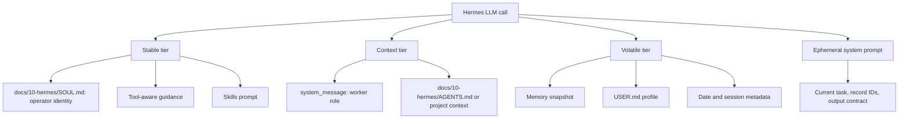
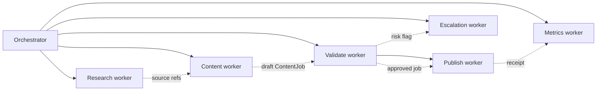

# Profile and Prompt Strategy

New Showbiz should use Hermes as a runtime substrate, not as the business product. The operator profile must keep identity, project rules, skills, worker roles, volatile memory, and dynamic task payloads in their correct prompt channels.

## Prompt Placement Contract

## What Goes Where

| Instruction type | Hermes channel | New Showbiz example |
|---|---|---|
| Public brand identity | `docs/10-hermes/SOUL.md` | New Showbiz voice, Kakusu Protocol, no unsupported claims |
| Repo/operator rules | `docs/10-hermes/AGENTS.md` context file | Tool routing, risk classes, module boundaries, X strategy |
| Worker role | `system_message` | "You are PublishAgent. Publish only approved ContentJobs." |
| Current task | `ephemeral_system_prompt` | `ContentJob nsb-2026-001 must produce three X drafts` |
| Reusable procedure | Skill file | `x-publish-with-receipt`, `escalation-record-create` |
| Durable business truth | Domain store | ContentJob, EngagementJob, EscalationRecord, PerformanceSnapshot |

## Profile Rule

The dedicated Hermes profile is named `newshowbiz`. It should load:

- `docs/10-hermes/SOUL.md` as stable identity.
- `docs/10-hermes/AGENTS.md` as project context.
- skills for procedures, not product strategy.
- narrow toolsets per workflow.
- profile-scoped env/secrets.
- gateway settings for human oversight only.

Do not rely on session history for business truth. Cron prompts must fetch durable state or include all required record IDs.

## Worker Spawn Strategy

Workers should usually use `skip_context_files=True`, `load_soul_identity=False`, and a role-specific `system_message` unless they are intentionally operating as the full New Showbiz operator. The orchestrator owns context selection and passes only the task-specific state needed for the worker.

## Cache Discipline

Keep stable and context tiers stable across long sessions. Put changing task payloads in `ephemeral_system_prompt`. This preserves provider prefix caching and makes worker behavior easier to audit.

