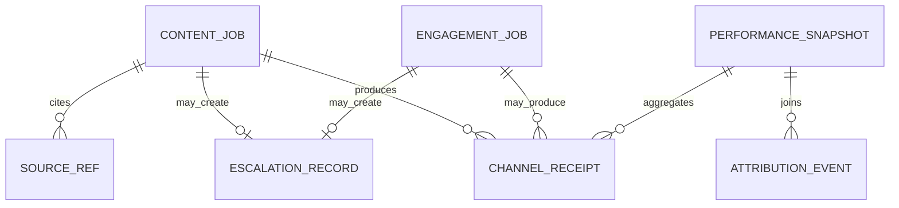

# Domain Contracts

These contracts are the minimum durable state model. Field names may be expanded by implementation, but the concepts are not optional.

## Record Relationship Diagram

## ContentJob

| Field | Required | Notes |
|---|---:|---|
| `id` | yes | Stable internal ID |
| `kind` | yes | `original`, `reply`, `quote`, `thread`, `carousel`, `report` |
| `platform` | yes | `x` or internal preview |
| `status` | yes | `draft`, `needs_revision`, `approved`, `scheduled`, `published`, `hold`, `failed` |
| `text` | yes | Draft or final text |
| `source_refs` | yes | Product pages, movie IDs, external sources, evidence notes |
| `risk_level` | yes | `low`, `medium`, `high`, `blocked` |
| `approval` | yes | human or machine gate result |
| `idempotency_key` | yes | Prevent duplicate public writes |
| `receipt_ids` | after write | One or more channel receipts |

## EngagementJob

| Field | Required | Notes |
|---|---:|---|
| `id` | yes | Stable internal ID |
| `platform` | yes | Inbound source |
| `raw_payload_ref` | yes | Stored raw item reference |
| `classification` | yes | support, discovery, factual dispute, complaint, spam, partnership, legal, other |
| `sentiment` | yes | positive, neutral, negative, hostile, unknown |
| `urgency` | yes | low, normal, high, critical |
| `risk_flags` | yes | Zero or more escalation triggers |
| `disposition` | yes | respond, ignore, redirect, escalate, hold |

## EscalationRecord

| Field | Required | Notes |
|---|---:|---|
| `id` | yes | Stable internal ID |
| `source_record_id` | yes | ContentJob or EngagementJob |
| `risk_class` | yes | One of the defined escalation classes |
| `summary` | yes | Neutral incident summary |
| `evidence_refs` | yes | Links, payload refs, screenshots, source records |
| `status` | yes | `open`, `held`, `approved`, `rejected`, `resolved` |
| `human_owner` | yes | Person or queue responsible |
| `recommended_action` | yes | approve, revise, hold, respond, ignore, investigate |

## PerformanceSnapshot

| Field | Required | Notes |
|---|---:|---|
| `id` | yes | Period snapshot ID |
| `period_start` | yes | ISO date/time |
| `period_end` | yes | ISO date/time |
| `content_job_ids` | yes | Posts included |
| `channel_metrics` | yes | Views, likes, replies, saves, shares, follows, profile visits where available |
| `site_metrics` | yes | Sessions, signups, ratings, reviews, watchlists, where-to-watch clicks where available |
| `support_metrics` | yes | Donations and support events where available |
| `recommendations` | yes | Continue, revise, stop, investigate |

