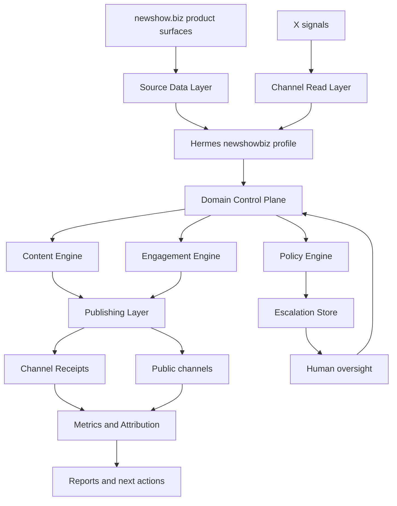
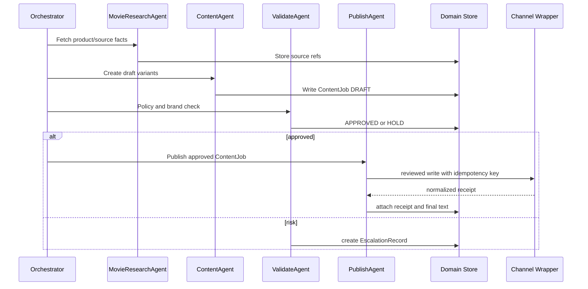
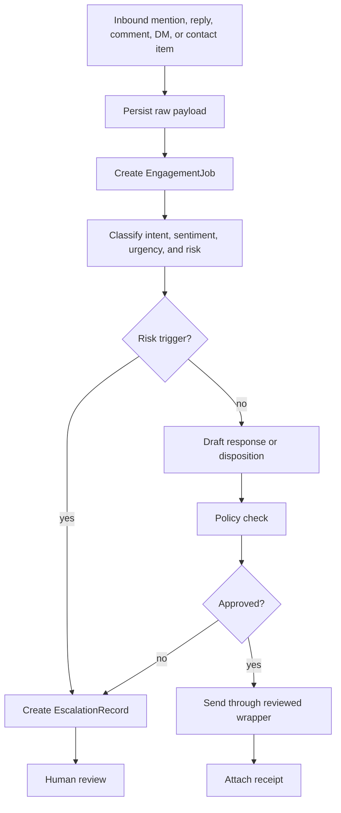

# Implementation Spec

This spec defines the build target for the New Showbiz Hermes-backed marketing operator. It is implementation-ready documentation, not executable code.

## Architecture

## Required Domain Records

The implementation must create durable records outside Hermes core.

| Record | Purpose | Required behavior |
|---|---|---|
| `ContentJob` | Tracks a content unit from source material through draft, approval, publish, receipt, and metrics | Must carry source refs, channel target, approval state, idempotency key, and final text |
| `EngagementJob` | Tracks an inbound mention, reply, comment, DM, or contact-path item | Must classify intent, sentiment, urgency, risk, and final disposition |
| `EscalationRecord` | Holds a blocked or risky item for human review | Must preserve evidence, risk class, recommended action, owner, and status |
| `PerformanceSnapshot` | Captures performance over a reporting period | Must join channel metrics to site traffic, signups, donations, activation, and support outcomes where available |

See [Domain Contracts](domain-contracts.md) for field-level detail.

## Outbound Content Flow

## Inbound Engagement Flow

## Tool Boundary Requirements

- Read tools and write tools are separate toolsets.
- Public writes are never performed through arbitrary browser or shell improvisation.
- Every write returns a durable receipt.
- Every write uses an idempotency key where possible.
- X browser automation failures must classify auth, login wall, CAPTCHA, Cloudflare or `403`, selector drift, rate limit, network, account warning, or unknown.
- Telegram is an oversight channel, not a public publishing path.
- Vault/source tools cannot publish to X.

## Policy Requirements

Policy must run before publish or reply. It must block or escalate:

- money terms beyond approved donation language
- tax, refund, wallet-choice, investment, or financial advice
- partnership, sponsorship, affiliate, or collaboration terms
- legal threats or legal claims
- creator complaints
- invalid diversity analysis reports
- factual disputes requiring validation
- identity-sensitive conflict
- platform-policy warnings
- high-visibility backlash
- unsupported claims
- `TROLL` output crossing thresholds

## Acceptance Standard

The implementation is not ready for autonomous posting until source refs, ContentJob approval state, policy checks, channel receipts, account-safety diagnostics, and human pause controls all work in the same end-to-end test.

