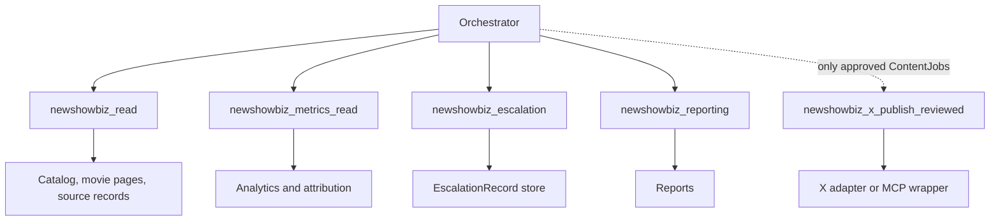

# Tool Boundaries

The operator must use narrow toolsets. Tool exposure is the main runtime safety boundary after policy.

## Toolset Classes

| Toolset | Capability | Write access |
|---|---|---:|
| `newshowbiz_read` | Product pages, movie data, approved source records | no |
| `newshowbiz_browser_read` | Browser inspection and QA | no |
| `newshowbiz_x_read` | X search, profile, timeline, trend, post, account status | no |
| `newshowbiz_x_draft_context` | Read-only X context packing for drafts | no |
| `newshowbiz_x_publish_reviewed` | Approved X posts, replies, quote-posts, threads, media | yes |
| `newshowbiz_x_account_safety` | Login, CAPTCHA, rate limit, Cloudflare, selector diagnostics | no public writes |
| `newshowbiz_metrics_read` | Platform, site, support, and activation metrics | no |
| `newshowbiz_escalation` | Create/update escalation records | internal only |
| `newshowbiz_reporting` | Create reports and snapshots | internal only |

## Non-Negotiable Rules

- No worker receives write tools unless its task requires writes.
- No write-capable workflow runs without an idempotency key.
- No public write runs without policy result and approval state.
- No X write falls back to raw Playwright publishing if the reviewed wrapper fails.
- Like, retweet, bookmark, follow, and mass engagement actions are manual-only in v1.

