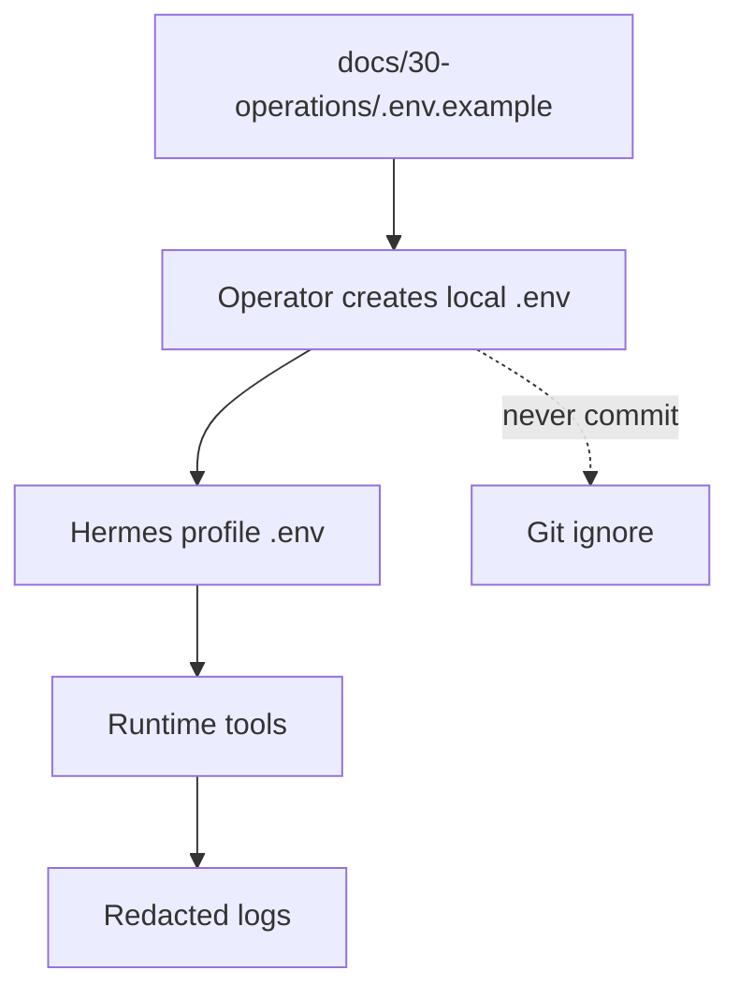

# Environment Setup

The local `.env` file is secret-bearing state. Keep it local, keep it out of git, and never copy values into documentation or prompts. This package documents variable names and handling rules only.

Root `AGENTS.md` and root `MEMORY.md` are also local and ignored. Use them only for checkout-specific agent guidance and local change memory; canonical profile context remains `docs/10-hermes/AGENTS.md`, and package-wide documentation process remains `docs/30-operations/documentation-governance.md`.

## Environment Flow

## Required for Phase 1

| Variable | Required | Purpose |
|---|---:|---|
| `OPENAI_API_KEY` | yes | Phase 0-1 OpenAI/Codex generation |
| `INGEST_ENABLED` | yes | Global X read kill switch — set `false` to halt all X reads |
| `TWITTER_USERNAME` | if x-mcp enabled | X account handle (without @) or email — use a dedicated account |
| `TWITTER_PASSWORD` | if x-mcp enabled | X account password for Barresider/x-mcp |
| `X_AUTH_DIR` | if x-mcp enabled | Absolute path for Barresider session persistence |
| `SCWEET_AUTH_TOKEN` | if Scweet reads enabled | Alternative cookie-based read path |
| `SCWEET_CT0` | if Scweet reads enabled | Throwaway read account CSRF cookie |
| `SCWEET_ACCOUNT_USERNAME` | if Scweet reads enabled | Audit identity for read account |
| `DRAFTS_BASE_DIR` | yes | Draft output base in future implementation |
| `LOG_DIR` | yes | Structured logs and trace IDs |
| `LOG_LEVEL` | yes | Runtime logging level |
| `HERMES_PROFILE` | yes | Expected value: `newshowbiz` |

## Required for Telegram Oversight

| Variable | Required | Purpose |
|---|---:|---|
| `TELEGRAM_BOT_TOKEN` | yes when gateway enabled | BotFather token |
| `TELEGRAM_ALLOWED_CHAT_IDS` | yes when gateway enabled | Human oversight allowlist |
| `NEWSHOWBIZ_ALLOWED_CHAT_IDS` | yes when plugin enabled | Operator command allowlist |

## Optional or Later-Phase Variables

| Variable | Phase | Purpose |
|---|---|---|
| `MODEL_ENDPOINT_URL` | Phase 2+ | Local vLLM or compatible endpoint |
| `MODEL_NAME` | Phase 2+ | Runtime model selection |
| `PROXY_LIST_PATH` | Phase 1+ | Optional Scweet proxy rotation |
| `OPEN_ROUTER_API` | optional | Alternative model routing |
| `AWS_*` | optional/platform | Hosting or deployment account |
| `STRIPE_SECRET_KEY` | future | Donation/support metrics integration |
| `STRIPE_WEBHOOK_SECRET` | future | Stripe webhook validation |
| `GITHUB_PAT_WRITE` | operational | GitHub automation, if used |
| `HUGGINGFACE_WRITE` | model ops | Hugging Face model/dataset operations |
| `CENSUSDATA_KEY` | optional research | Census data access, if used |

## Phase 1 OpenAI/Codex Setup

1. Set `OPENAI_API_KEY`.
2. Leave `MODEL_ENDPOINT_URL` and `MODEL_NAME` blank unless using a compatible proxy.
3. Keep public writes disabled.
4. Generate drafts only.
5. Store source refs and draft metadata.

## Phase 2+ vLLM Setup

Use config-driven model selection so migration does not change business logic. Preferred vLLM notes from the operator contract:

- tensor parallelism over 2 GPUs when available
- `--attention-backend FLASHINFER`
- `--disable-custom-all-reduce`
- `NCCL_P2P_DISABLE=1`
- `NCCL_IB_DISABLE=1`
- `TORCH_NCCL_ENABLE_MONITORING=0`
- `TORCH_NCCL_HEARTBEAT_TIMEOUT_SEC=7200`
- compose runtime with `shm_size: 16gb`, `ipc: host`, and `ulimits.memlock: -1`

## Scweet X Read-Only Setup

- Use only a dedicated throwaway read account.
- Never use the brand `@new_show_biz` account cookies.
- Set `INGEST_ENABLED=false` to disable all X reads immediately.
- Log timestamp, query, account used, and item IDs for every fetch.
