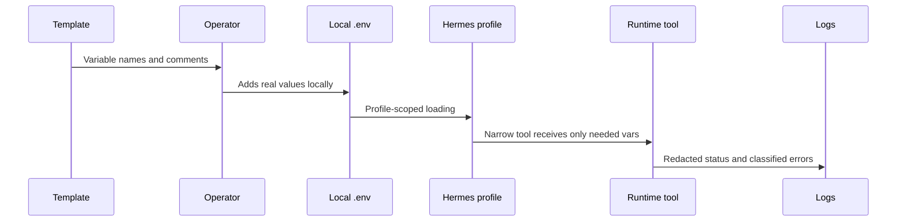

# Secrets Policy

Secrets are required for the eventual operator, but this repository must not contain secret values.

## Lifecycle

## Rules

- `.env` stays local.
- `.env.example` contains names, comments, and placeholders only.
- Secret-bearing lines are never pasted into docs, prompts, issue comments, commits, or reports.
- Logs include variable names only when helpful and never include values.
- X cookies belong only to the throwaway read account in Phase 1.
- Production channel-write credentials must be scoped to reviewed wrapper tools.
- Stripe, AWS, GitHub, and Hugging Face credentials are optional or later-phase unless a specific integration requires them.

## Handling by Credential Family

| Family | Handling |
|---|---|
| AWS | Least privilege, short-lived credentials preferred, no console password use by agents |
| OpenAI/OpenRouter | Model runtime only, rotate if exposed |
| Stripe | Read metrics or validate webhooks only until donation workflows are explicitly specified |
| GitHub | Avoid write PATs unless release automation is part of a documented workflow |
| Hugging Face | Use for model operations only, never for public channel actions |
| Telegram | Gateway oversight only, allowlisted chat IDs |
| Scweet/X cookies | Throwaway read account only, kill switch required |

