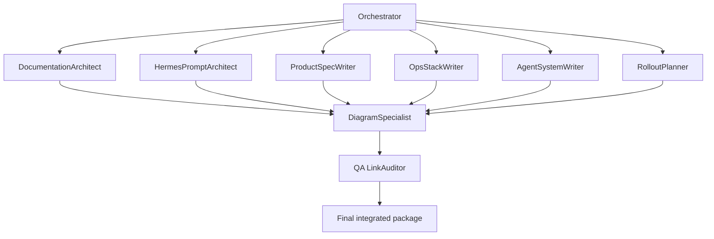
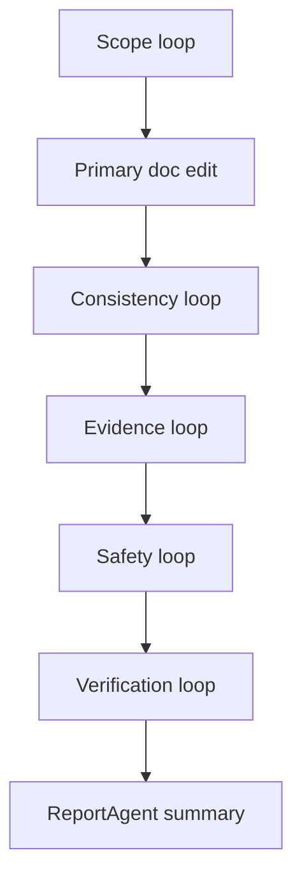
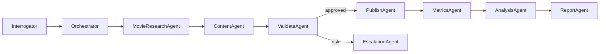

# Subagent Execution Plan

Subagents are the execution pattern for building and operating the New Showbiz system. The orchestrator decomposes work, assigns workers with narrow toolsets, validates outputs, and stores durable results outside Hermes.

Simple, low-risk work may use the Orchestrator Simple Task Fast Path: one specialist or ExecuteAgent, Orchestrator validation, then ReportAgent. Composite documentation changes, new agents, policy changes, runtime behavior changes, and external-current claims should use the full workflow.

## Implementation Subagent DAG

## Documentation Update Loop

## Build-Time Worker Ownership

| Worker | Owns | Must not edit |
|---|---|---|
| DocumentationArchitect | `README.md`, link map, package organization, documentation-governance updates | domain contracts, env details |
| HermesPromptArchitect | `docs/10-hermes/` | rollout docs, operations docs |
| ProductSpecWriter | `docs/00-vision/`, `docs/20-system-spec/` | secrets, model cards |
| OpsStackWriter | `docs/30-operations/` | product positioning, agent roster |
| AgentSystemWriter | `docs/40-agents/` | env setup, channel specs |
| RolloutPlanner | `docs/50-rollout/` | source agent specs |
| DiagramSpecialist | Mermaid diagrams across docs | prose contracts unless fixing labels |
| QA LinkAuditor | stale links, one-H1, secret scan, path scan | substantive product decisions |

## Runtime Worker Pattern

## Worker Rules

- Workers receive the minimum context needed.
- Workers get only the toolsets needed for the task.
- Workers do not publish unless they are the reviewed PublishAgent path.
- Workers return structured outputs with status, claims, artifacts, and blockers.
- The orchestrator validates outputs before downstream propagation.
- Any reusable procedure missing from the skill registry becomes a skill proposal.
- Documentation workers update affected indexes, maps, and phase status before task close.
- Documentation workers run the evidence and safety loops for current claims and secret-bearing surfaces.
