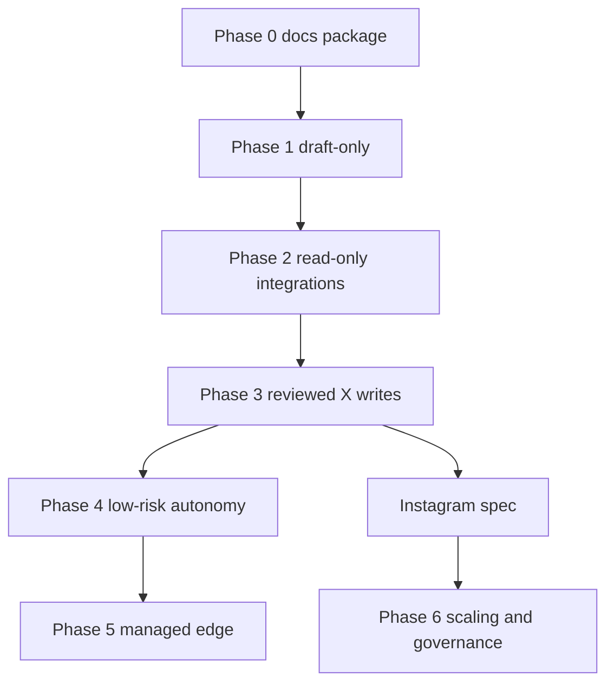

# Acceptance Criteria

These criteria decide when the operator can move between phases.

## Dependency Graph

## Phase Gates

| Phase | Must be true before exit |
|---|---|
| 0 | Docs package complete, env template documented, risks and domain contracts specified |
| 1 | Drafts generated with source refs, validation results, and no public writes |
| 2 | Read-only integrations cannot access write tools; metrics snapshots are reproducible |
| 3 | Reviewed X writes return durable receipts and classify failures |
| 4 | Pause path works, low-risk autonomous jobs are bounded, daily reports reconcile receipts |
| 5 | TROLL or edge workflows are incident-reviewed, fact-bound, and suspendable |
| 6 | Instagram, scale, and governance hardening have their own tested wrappers |

## End-to-End Write Readiness

No autonomous write is allowed until:

- ContentJob schema exists.
- Policy engine blocks all escalation classes.
- Human approval path exists.
- Reviewed channel wrapper exists.
- Receipt store exists.
- Idempotency is tested.
- Account safety diagnostics exist.
- Pause command or equivalent interrupt exists.

