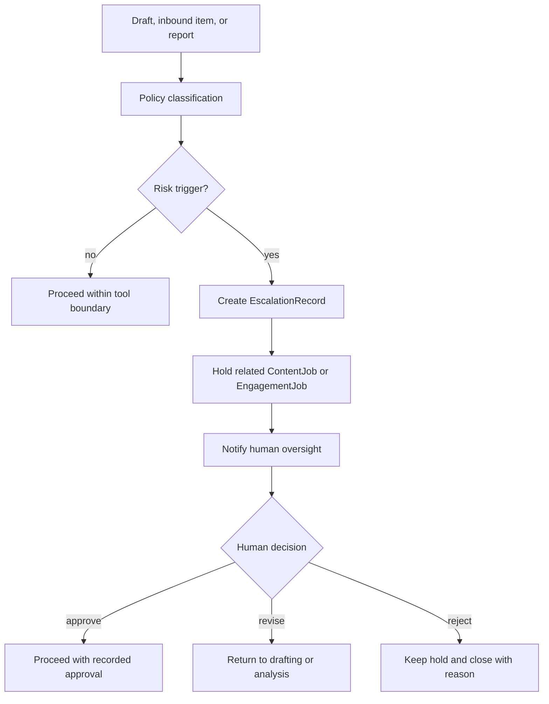

# Risk Register

## Escalation Flow

## Primary Risks

| Risk | Severity | Control |
|---|---|---|
| Unsupported score or plot claim | high | Source refs required, MovieResearchAgent validation |
| Identity-sensitive conflict | high | EscalationRecord and human review |
| Creator complaint | high | Hold and route to human owner |
| Money/tax/crypto advice | high | Approved donation language only |
| X account warning or automation block | high | Account safety toolset, kill switch, pause writes |
| Duplicate publish | medium | Idempotency key and receipt lookup |
| Persona fragmentation | medium | One public New Showbiz voice |
| Metrics over-optimization for outrage | medium | Optimize qualified traffic, signup, support, trust |
| Secret leakage | high | `.env` local only, redacted docs only |

